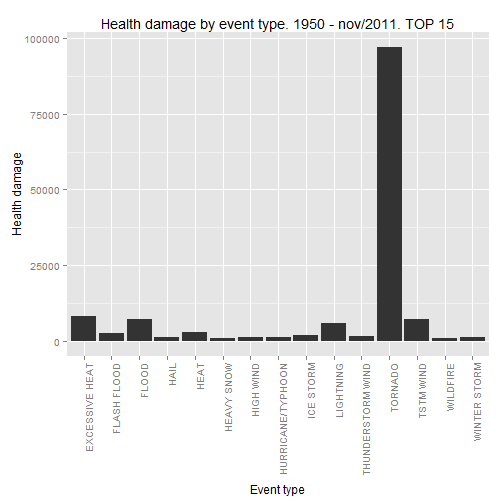
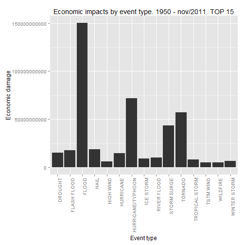

#Climate event impacts  


Synopsis: This document report the 15 top causes of fatalities, injuries, property and crop damages during climate events in the United States. The data comes from NOAA storm database. The main goal is to identify the weather events that cause more damages to population health and economic impacts. The tornados are the most harmful events to population health while flood causes more impact in economy.  


Author: Marcus Vinícius  


Date: Tuesday, February 17, 2015


### Data Processing  


##### Get the original data  


The file must have been downloaded from "https://d396qusza40orc.cloudfront.net/repdata%2Fdata%2FStormData.csv.bz2" and saved in R directory with the name "repdata-data-StormData.csv.bz2". The database will be stored in the "data" data frame.


```r
data<-read.csv("repdata-data-StormData.csv.bz2", header=TRUE, sep=",", na.strings=" ")
```


##### Subset the original data  


The "data" data frame has 37 variables. Most of them are unnecessary, so I have subset to the following 16 variables:

BGN_DATE, COUNTY, COUNTYNAME, STATE, EVTYPE, LENGTH, WIDTH, F, MAG, FATALITIES, INJURIES, PROPDMG, PROPDMGEXP, CROPDMG, CROPDMGEXP, REFNUM


```r
sub_data<-data[,c("BGN_DATE", "COUNTY", "COUNTYNAME", "STATE", "EVTYPE", "LENGTH", "WIDTH", "F", "MAG", "FATALITIES", "INJURIES", "PROPDMG", "PROPDMGEXP", "CROPDMG", "CROPDMGEXP", "REFNUM")]
```


##### Create new columns  


The sub_data has the columns with the property and crops damages and also their respecting magnifying factor. The magnifying factor has the factors M for millions, B for billions and k for thousands. To obtain the total cost, the values of the property and crops damages must be multiplied by their respecting magnifying factor.


```r
sub_data$PROPDMGEXP<-as.character(sub_data$PROPDMGEXP)
sub_data$PROPDMGEXP[grep("K", sub_data$PROPDMGEXP)] <- "1000"
sub_data$PROPDMGEXP[grep("M", sub_data$PROPDMGEXP)]<-"1000000"
sub_data$PROPDMGEXP[grep("m", sub_data$PROPDMGEXP)]<-"1000000"
sub_data$PROPDMGEXP[grep("B", sub_data$PROPDMGEXP)]<-"1000000000"
othervalues<-!(sub_data$PROPDMGEXP %in% c("1000", "1000000", "1000000000")) == 1
sub_data$PROPDMGEXP[othervalues==1]<-"1"
sub_data$CROPDMGEXP<-as.character(sub_data$CROPDMGEXP)
sub_data$CROPDMGEXP[grep("K", sub_data$CROPDMGEXP)] <- "1000"
sub_data$CROPDMGEXP[grep("M", sub_data$CROPDMGEXP)] <- "1000000"
sub_data$CROPDMGEXP[grep("B", sub_data$CROPDMGEXP)] <- "1000000000"
othervalues<-!(sub_data$CROPDMGEXP %in% c("1000", "1000000", "1000000000")) == 1
sub_data$CROPDMGEXP[othervalues==1]<-"1"
sub_data$PROPDMG<-as.numeric(sub_data$PROPDMG)
sub_data$PROPDMGEXP<-as.numeric(sub_data$PROPDMGEXP)
sub_data$CROPDMG<-as.numeric(sub_data$CROPDMG)
sub_data$CROPDMGEXP<-as.numeric(sub_data$CROPDMGEXP)
sub_data$property<-sub_data$PROPDMG * sub_data$PROPDMGEXP
sub_data$crop<- sub_data$CROPDMG * sub_data$CROPDMGEXP
```


##### Create the population health and monetary damages variables  


The total health and monetary damages are created and stored at the health and economic data frames, respectively.


```r
# population health
sub_data$EVTYPE<-as.character(sub_data$EVTYPE)
sub_data$FATALITIES<-as.numeric(sub_data$FATALITIES)
sub_data$INJURIES<-as.numeric(sub_data$INJURIES)
sub_data$EVTYPE<-as.character(sub_data$EVTYPE)
fatalities<-aggregate(FATALITIES ~ EVTYPE, sub_data, sum)
injuries<-aggregate(INJURIES ~ EVTYPE, sub_data, sum)
sub_data$health<-sub_data$FATALITIES + sub_data$INJURIES
health<-aggregate(health ~ EVTYPE, sub_data, sum)

# Monetary damages (crop), property damages (PROPDMG)
property<-aggregate(property ~ EVTYPE, sub_data, sum)
crop<-aggregate(crop ~ EVTYPE, sub_data, sum)
sub_data$economic<-sub_data$property + sub_data$crop
economic<-aggregate(economic ~ EVTYPE, sub_data, sum)

fatalities<-fatalities[!fatalities$FATALITIES == 0, ]
injuries<-injuries[!injuries$INJURIES == 0, ]
property<-property[!property$property == 0, ]
crop<-crop[!crop$crop == 0, ]
health<-health[!health$health == 0, ]
economic<-economic[!economic$economic == 0, ]

# Top 15 causes
fatalities15<-head(fatalities[order(fatalities$FATALITIES, decreasing=T),],15)
injuries15<-head(injuries[order(injuries$INJURIES, decreasing=T),],15)
property15<-head(property[order(property$property, decreasing=T),],15)
crop15<-head(crop[order(crop$crop, decreasing=T),],15)
health15<-head(health[order(health$health, decreasing=T), ], 15)
economic15<-head(economic[order(economic$economic, decreasing=T), ], 15)
```


### Results  


##### Top 15 events  


Top 15 events that causes more fatalities  


```r
fatalities15<-head(fatalities[order(fatalities$FATALITIES, decreasing=T),],15)
options(scipen=999)
print(fatalities15)
```

```
##                EVTYPE FATALITIES
## 834           TORNADO       5633
## 130    EXCESSIVE HEAT       1903
## 153       FLASH FLOOD        978
## 275              HEAT        937
## 464         LIGHTNING        816
## 856         TSTM WIND        504
## 170             FLOOD        470
## 585       RIP CURRENT        368
## 359         HIGH WIND        248
## 19          AVALANCHE        224
## 972      WINTER STORM        206
## 586      RIP CURRENTS        204
## 278         HEAT WAVE        172
## 140      EXTREME COLD        160
## 760 THUNDERSTORM WIND        133
```


Top 15 events that causes more injuries  


```r
injuries15<-head(injuries[order(injuries$INJURIES, decreasing=T),],15)
options(scipen=999)
print(injuries15)
```

```
##                EVTYPE INJURIES
## 834           TORNADO    91346
## 856         TSTM WIND     6957
## 170             FLOOD     6789
## 130    EXCESSIVE HEAT     6525
## 464         LIGHTNING     5230
## 275              HEAT     2100
## 427         ICE STORM     1975
## 153       FLASH FLOOD     1777
## 760 THUNDERSTORM WIND     1488
## 244              HAIL     1361
## 972      WINTER STORM     1321
## 411 HURRICANE/TYPHOON     1275
## 359         HIGH WIND     1137
## 310        HEAVY SNOW     1021
## 957          WILDFIRE      911
```


Top 15 events that causes more property damages  


```r
property15<-head(property[order(property$property, decreasing=T),],15)
options(scipen=999)
print(property15)
```

```
##                EVTYPE     property
## 170             FLOOD 144657709807
## 411 HURRICANE/TYPHOON  69305840000
## 834           TORNADO  56937160779
## 670       STORM SURGE  43323536000
## 153       FLASH FLOOD  16140812067
## 244              HAIL  15732267048
## 402         HURRICANE  11868319010
## 848    TROPICAL STORM   7703890550
## 972      WINTER STORM   6688497251
## 359         HIGH WIND   5270046295
## 590       RIVER FLOOD   5118945500
## 957          WILDFIRE   4765114000
## 671  STORM SURGE/TIDE   4641188000
## 856         TSTM WIND   4484928495
## 427         ICE STORM   3944927860
```


Top 15 events that causes more crop damages  


```r
crop15<-head(crop[order(crop$crop, decreasing=T),],15)
options(scipen=999)
print(crop15)
```

```
##                EVTYPE        crop
## 95            DROUGHT 13972566000
## 170             FLOOD  5661968450
## 590       RIVER FLOOD  5029459000
## 427         ICE STORM  5022113500
## 244              HAIL  3025537890
## 402         HURRICANE  2741910000
## 411 HURRICANE/TYPHOON  2607872800
## 153       FLASH FLOOD  1421317100
## 140      EXTREME COLD  1292973000
## 212      FROST/FREEZE  1094086000
## 290        HEAVY RAIN   733399800
## 848    TROPICAL STORM   678346000
## 359         HIGH WIND   638571300
## 856         TSTM WIND   554007350
## 130    EXCESSIVE HEAT   492402000
```


**Top 15 harmful events to population health**  


The graph below shows that tornados causes more damages to population health.  


```r
health15<-head(health[order(health$health, decreasing=T), ], 15)
options(scipen=999)
print(health15)
```

```
##                EVTYPE health
## 834           TORNADO  96979
## 130    EXCESSIVE HEAT   8428
## 856         TSTM WIND   7461
## 170             FLOOD   7259
## 464         LIGHTNING   6046
## 275              HEAT   3037
## 153       FLASH FLOOD   2755
## 427         ICE STORM   2064
## 760 THUNDERSTORM WIND   1621
## 972      WINTER STORM   1527
## 359         HIGH WIND   1385
## 244              HAIL   1376
## 411 HURRICANE/TYPHOON   1339
## 310        HEAVY SNOW   1148
## 957          WILDFIRE    986
```


```r
library(ggplot2)
```

```
## Warning: package 'ggplot2' was built under R version 3.1.2
```

```r
health_graph<-ggplot(health15, aes(x=EVTYPE, y=health))
health_graph<-health_graph + geom_bar(stat="identity") + xlab("Event type") + ylab("Health damage") +
        theme(axis.text.x = element_text(angle = 90, hjust = 1)) + 
        ggtitle("Health damage by event type. 1950 - nov/2011. TOP 15")
print(health_graph)
```

 


**Top 15 events which have the greatest economic consequences** 


The graphic below shows that flood causes the greatest economic consequences.


```r
economic15<-head(economic[order(economic$economic, decreasing=T), ], 15)
options(scipen=999)
print(economic15)
```

```
##                EVTYPE     economic
## 170             FLOOD 150319678257
## 411 HURRICANE/TYPHOON  71913712800
## 834           TORNADO  57352114049
## 670       STORM SURGE  43323541000
## 244              HAIL  18757804938
## 153       FLASH FLOOD  17562129167
## 95            DROUGHT  15018672000
## 402         HURRICANE  14610229010
## 590       RIVER FLOOD  10148404500
## 427         ICE STORM   8967041360
## 848    TROPICAL STORM   8382236550
## 972      WINTER STORM   6715441251
## 359         HIGH WIND   5908617595
## 957          WILDFIRE   5060586800
## 856         TSTM WIND   5038935845
```

    


```r
economic_graph<-ggplot(economic15, aes(x=EVTYPE, y=economic))
economic_graph<-economic_graph + geom_bar(stat="identity") + xlab("Event type") + ylab("Economic damage") +
        theme(axis.text.x = element_text(angle = 90, hjust = 1)) +
        ggtitle("Economic impacts by event type. 1950 - nov/2011. TOP 15")
print(economic_graph)
```

 

